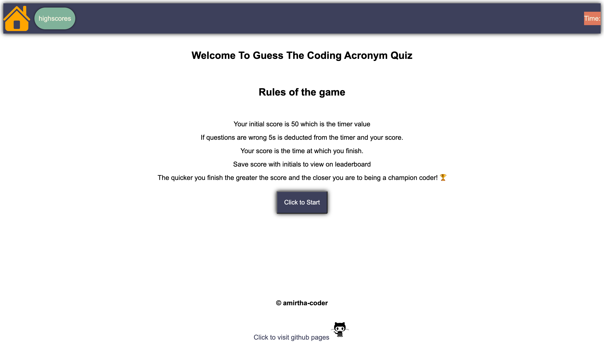
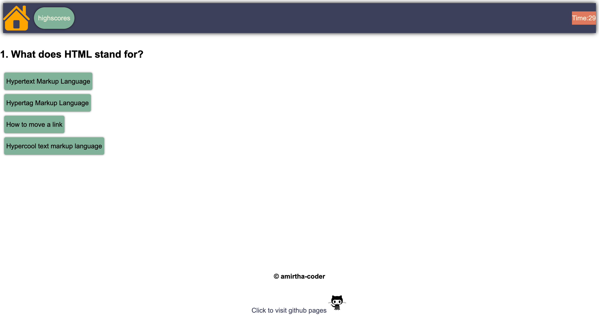
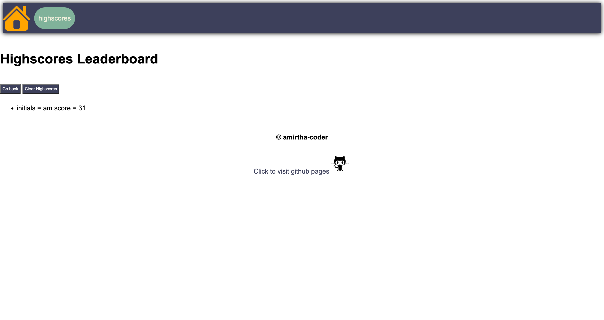

# timed-code-quiz

## Deployed URL

Click the link [here](https://amirtha-coder.github.io/timed-code-quiz/) to access the webpage.

## Description

To create this timed code quiz I had to used HTML, CSS, Javascript and Web APIs.

1. When the user loads the quiz I wanted them to have a responsive webpage that will work on different screens
2. When the user loads the screen they should be presented with nav bar, start section and footer.
3. Via javascript I removed the start section so that the user can be presented with question.
4. I set event.currentTarget = correct answer and event.target = answer for each question.
5. I used if or else conditions to then if correct answer allow user to continue or display alert.
6. When quiz timer = 0 or the user finishes the quiz a form should displayed.
7. The quiz form should contain score which is equivalent to the time at finish and should create initials with an input box alongside.
8. The user should be displayed the two different alerts for correct and wrong input values when they click submit.
9. Local storage stores the values and these values should be displayed on high scores webpage.
10. The clear highscores button should remove high scores from local storage.

## Screenshots

### Code quiz start

### Code quiz question

### Code quiz highscores page

## Technologies

- html
- css
- coolers
- javascript
- git

## Previous projects

- #### Project 1: semantic HTML and adding CSS to refactor the webpage for a marketing agency. Click the link [here](https://winner-am1.github.io/semantic_html_refactor/) to access the webpage.
- #### Project 2: My professional portfolio created using HTML and CSS.Click the link [here](https://amirtha-coder.github.io/amirtha-portfolio/) to access the webpage.
- #### Project 3: My random password generator created via javascript. Click the link [here](https://amirtha-coder.github.io/random-password-generator/) to access the webpage.
- ..._PENDING_...
